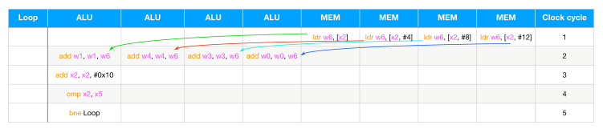
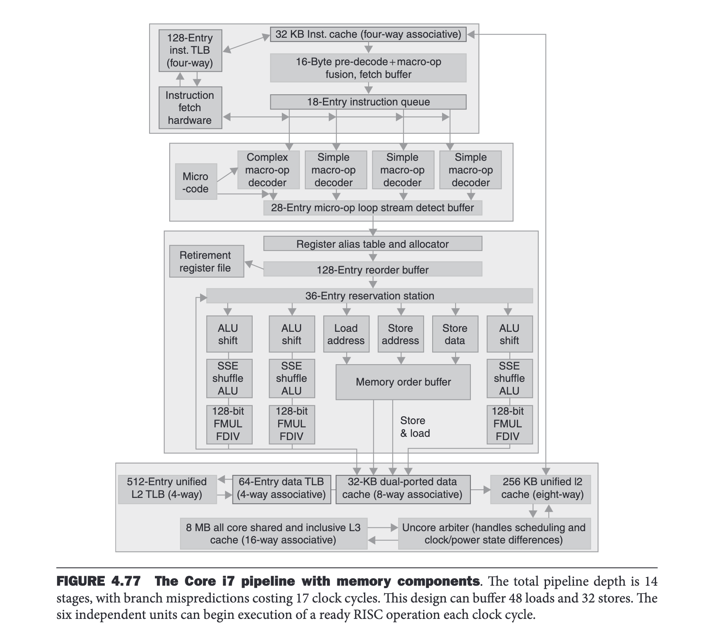

# Loop Unrolling and ILP

## Show Me the Code
See https://godbolt.org/z/7P8n3TT1v
```c++
constexpr int array_size = 100'000'000;
constexpr int unroll_factor = 4;

int sum_simple(int arr[], int size) {
    int sum = 0;
    for (int i = 0; i < size; i++) {
        sum += arr[i];
    }
    return sum;
}

int sum_unrolling(int arr[], int size) {
    int sum = 0;
    for (int i = 0; i < size; i += unroll_factor) {
        sum += arr[i];
        sum += arr[i + 1];
        sum += arr[i + 2];
        sum += arr[i + 3];
    }
    return sum;
}

// use local sums to apply instruction-level parallelism (ILP)
// so these 4 increments can run concurrently ;)
int sum_unrolling_local_array(int arr[], int size) {
    int sum[unroll_factor] = {0};
    for (int i = 0; i < size; i += unroll_factor) {
        sum[0] += arr[i];
        sum[1] += arr[i + 1];
        sum[2] += arr[i + 2];
        sum[3] += arr[i + 3];
    }
    return sum[0] + sum[1] + sum[2] + sum[3];
}
```
We use `-O1` to generate more human-readable assembly code and it looks
most like our intention (`-O2` is gonna produce SIMD stuff).

Their loop bodies in `x86_64` assembly:
```assembly
sum_simple(int*, int):
.L3:
        addl    (%rax), %edx
        addq    $4, %rax
        cmpq    %rcx, %rax
        jne     .L3

sum_unrolling(int*, int):
.L8:
        addl    (%rdx), %eax
        addl    4(%rdx), %eax
        addl    8(%rdx), %eax
        addl    12(%rdx), %eax
        addq    $16, %rdx
        cmpq    %rcx, %rdx
        jne     .L8

sum_unrolling_local_array(int*, int):
.L13:
        addl    (%rax), %edx
        addl    4(%rax), %edi
        addl    8(%rax), %esi
        addl    12(%rax), %ecx
        addq    $16, %rax
        cmpq    %r8, %rax
        jne     .L13
```
In `ARM64` assembly:
```assembly
sum_simple(int*, int):
.L3:
        ldr     w1, [x2], 4
        add     w0, w0, w1
        cmp     x2, x3
        bne     .L3

sum_unrolling(int*, int):
.L8:
        ldr     w3, [x2]
        add     w0, w0, w3
        ldr     w3, [x2, 4]
        add     w0, w0, w3
        ldr     w3, [x2, 8]
        add     w0, w0, w3
        ldr     w3, [x2, 12]
        add     w0, w0, w3
        add     x2, x2, 16
        cmp     x2, x1
        bne     .L8

sum_unrolling_local_array(int*, int):
.L13:
        ldr     w6, [x2]
        add     w1, w1, w6
        ldr     w6, [x2, 4]
        add     w4, w4, w6
        ldr     w6, [x2, 8]
        add     w3, w3, w6
        ldr     w6, [x2, 12]
        add     w0, w0, w6
        add     x2, x2, 16
        cmp     x2, x5
        bne     .L13
```
The generated `x86_64` and `ARM64` assembly codes look exactly like our C++ code!

## ARM64
On my [Mac M2 Pro](https://en.wikipedia.org/wiki/Apple_M2), gcc 12.3.0 with `-O1`
generates the same `ARM64` assembly. Running the program gives the following results:
```bash
$ g++ loop_unrolling.cc -o loop_unrolling -O1
$ ./loop_unrolling
sum_simple: -49993929
time taken: 0.036539 seconds
sum_unrolling: -49993929
time taken: 0.029103 seconds
sum_unrolling_local_array: -49993929
time taken: 0.013475 seconds
```

Now let's do some math!
`sum_unrolling` and `sum_unrolling_local_array` have the same amount of instructions.
But the former will constantly write the increases to `w0` register. So there's a true
data dependency here. The latter writes to their local sums (`w0-w3`). If the 4 pairs
of `ldr`s and `add`s were run concurrently, the amount of effective time in each
iteration would be `8/4 + 3 = 5` clock cycles (assume each instruction runs at 1 clock
cycle, temporal/spatial/branch locality are all good), and therefore the expected time
for `sum_unrolling_local_array` should be `5/11 * 0.029103 = 0.013229` seconds.
WOW! It's soooo close to the actual time `0.013475` seconds (we also need to sum up
those 4 local sums)!! That means ILP indeed happens on my Mac M2 Pro and our
speculation is probably right.



Wait a minute, someone might say, the `ldr`s seem to cause problems since they all
read values into the `w6` register, and then 4 concurrent reads from that register!
The answer is *register renaming* to the rescue! We can also try it ourselves.
First, let's compile our C++ code to assembly:
```bash
$ g++ loop_unrolling.cc -O1 -S -o loop_unrolling_manual_rr.s
```
Then we replace the loop part of `sum_unrolling_local_array` with:
```assembly
.L13:
	ldr	w6, [x2]
	add	w1, w1, w6
	ldr	w7, [x2, 4]
	add	w4, w4, w7
	ldr	w8, [x2, 8]
	add	w3, w3, w8
	ldr	w9, [x2, 12]
	add	w0, w0, w9
	add	x2, x2, 16
	cmp	x2, x5
	bne	.L13
```
That is, we manually perform the register renaming stuff (`w6-w9`).
Compile the modified assembly and run the final program:
```bash
$ g++ loop_unrolling_manual_rr.s -o loop_unrolling_manual_rr
$ ./loop_unrolling_manual_rr
sum_simple: -49993929
time taken: 0.036318 seconds
sum_unrolling: -49993929
time taken: 0.029206 seconds
sum_unrolling_local_array: -49993929
time taken: 0.013518 seconds
```
Pretty much the same! So, we can conclude that Apple M2 Pro processors do
use [register renaming](https://en.wikipedia.org/wiki/Register_renaming)
and are [superscalar](https://en.wikipedia.org/wiki/Superscalar_processor),
so that they can execute multiple independent instructions in parallel by
dispatching them to different functional units.

To better understand how register renaming works I'll use the following
image (although it's not ARM64, the overall principle should be similar ;):


*Image from Patterson and Hennessy's Computer Organization and Design:
The Hardware/Software Interface, Fifth Edition*

After the CPU decodes the 4 `add`s and 4 `ldr`s in `sum_unrolling_local_array`,
the instructions are copied into the reservation station. Any operands that are
available in the register file or reorder buffer are also immediately copied
into the reservation station. Then our ALUs that will execute the `add`
instructions will listen on the load/store units. When our 4 loads are
complete, their results are sent directly into the waiting reservation station
bypassing the registers, which in turn will be consumed by the ALUs. So,
our 4 `ldr` instructions won't write to the architectural register `w6`.
Instead, the physical register entries or the reservation station entries
will be written, which effectively implements register renaming.


Similar analysis can be made to `sum_simple` vs `sum_unrolling`:
one iteration in `sum_unrolling` effectively does 4 iterations in `sum_simple`.
Thus, the *instruction efficiency* of `sum_simple : sum_unrolling = 8/16 : 8/11 = 11/16`,
and `sum_unrolling` should probably take `11/16 * 0.036539 = 0.025121` seconds.
The real timing for `sum_unrolling` is somewhat higher, which may be due to different
memory access patterns.

Interestingly, if we compile our C++ code using `-O2` or `-O3` the timing for
`sum_unrolling_local_array` won't get better. Our `-O1` version is the fastest:
```bash
$ g++ loop_unrolling.cc -o loop_unrolling_O2 -O2
$ ./loop_unrolling_O2
sum_simple: -49993929
time taken: 0.015666 seconds
sum_unrolling: -49993929
time taken: 0.014830 seconds
sum_unrolling_local_array: -49993929
time taken: 0.015199 seconds
$ ./loop_unrolling # -O1 version
sum_simple: -49993929
time taken: 0.036902 seconds
sum_unrolling: -49993929
time taken: 0.029652 seconds
sum_unrolling_local_array: -49993929
time taken: 0.013504 seconds
```

## x86_64
On my 1-core `Intel(R) Xeon(R) Platinum 8269CY CPU @ 2.50GHz` server,
the C++ code compiled with gcc 12.1.0 has the following timings:
```bash
$ g++ loop_unrolling.cc -o loop_unrolling -O1
$ g++ loop_unrolling.cc -o loop_unrolling_O2 -O2
$ ./loop_unrolling
sum_simple: -49993929
time taken: 0.071673 seconds
sum_unrolling: -49993929
time taken: 0.065177 seconds
sum_unrolling_local_array: -49993929
time taken: 0.063575 seconds
$ ./loop_unrolling_O2
sum_simple: -49993929
time taken: 0.047116 seconds
sum_unrolling: -49993929
time taken: 0.050405 seconds
sum_unrolling_local_array: -49993929
time taken: 0.050756 seconds
```

`sum_unrolling` and `sum_unrolling_local_array` have similar performance in both
`-O1` and `-O2` (maybe because Xeon processors have got really powerful pipelines
and reordering functionality). For production-ready `-O2` optimizations, our simple
sum algorithm `sum_simple` is the fastest! (GCC knows what you're doing ;)
The disassembly by `-O2` is as follows:
```assembly
    # it's got inlined in main
    10fc:	e8 6f ff ff ff       	call   1070 <clock@plt>
    1101:	66 0f ef c0          	pxor   %xmm0,%xmm0
    1105:	49 89 c5             	mov    %rax,%r13
    1108:	0f 1f 84 00 00 00 00 	nopl   0x0(%rax,%rax,1)
    110f:	00
    1110:	66 0f fe 45 00       	paddd  0x0(%rbp),%xmm0
    1115:	48 83 c5 10          	add    $0x10,%rbp
    1119:	48 39 dd             	cmp    %rbx,%rbp
    111c:	75 f2                	jne    1110 <main+0x70>
    111e:	66 0f 6f c8          	movdqa %xmm0,%xmm1
    1122:	48 8d 2d eb 0e 00 00 	lea    0xeeb(%rip),%rbp        # 2014 <_IO_stdin_used+0x14>
    1129:	66 0f 73 d9 08       	psrldq $0x8,%xmm1
    112e:	66 0f fe c1          	paddd  %xmm1,%xmm0
    1132:	0f 29 04 24          	movaps %xmm0,(%rsp)
    1136:	e8 35 ff ff ff       	call   1070 <clock@plt>
```
The tight loop sits in `1110-111c` and it uses the 128-bit (16-byte) `%xmm` registers.
`paddd` performs a SIMD add of the packed integers from the source operand `0x0(%rbp)`
and `%xmm0`, and stores the packed integer results in `%xmm0`. Good illustrations
about the `paddd` instruction can be found
[here](https://www.officedaytime.com/simd512e/simdimg/binop.php?f=paddd).
When the loop exits, the 128-bit `%xmm0` register stores our 4 local 32-bit sums,
then let `%xmm1 = %xmm0` and right shift by 8 bytes (64 bits) `%xmm1 >>= 64`.
Then add the lower parts of `%xmm1` and `%xmm0` and store the result in the
memory location pointed to by the 64-bit `%rsp` register (a stack memory location).
Essentially, this is exactly what we're trying to do in `sum_unrolling_local_array`.

A more recent version of gcc (say 13.2) may unroll more instructions, the generated
loop can be something like this:
```assembly
.L21:
        paddd   0(%rbp), %xmm0
        addq    $32, %rbp
        paddd   -16(%rbp), %xmm0
        cmpq    %rbp, %rbx
        jne     .L21
```
There are two 16-byte packed adds. When compiled with `-O2 -mavx2`,
```assembly
.L21:
        vpaddd  (%r12), %ymm0, %ymm0
        addq    $64, %r12
        vpaddd  -32(%r12), %ymm0, %ymm0
        cmpq    %r12, %rbx
        jne     .L21
```
two 32-byte packed adds using the 256-bit `%ymm` registers can be generated.

Notice that the compiler also does an instruction reordering trick, it places
`addq` instruction in the middle of the two `paddd` instructions, which makes
the pipelining somewhat more balanced.
