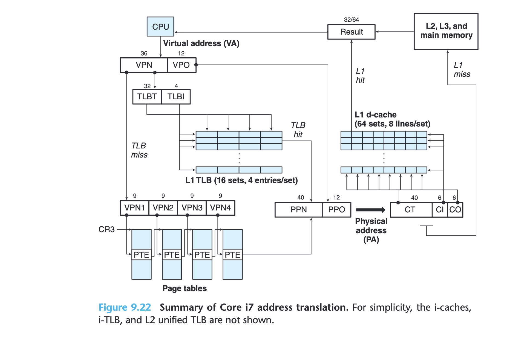
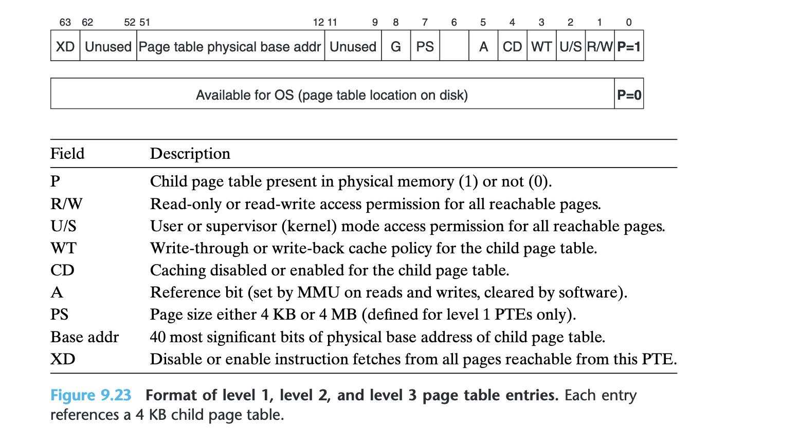
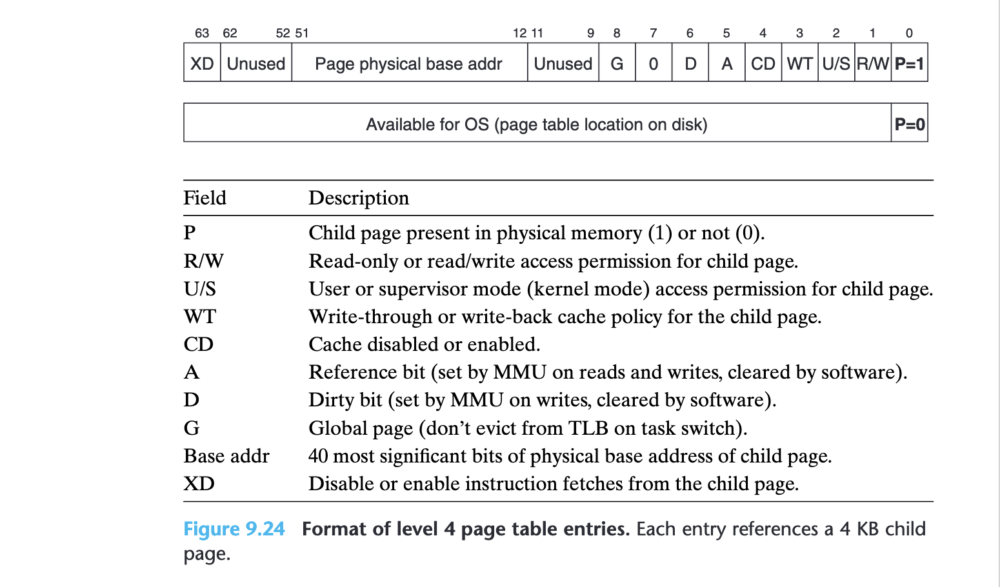

## Spectre 👻

See the running example on [Godbolt].

Chandler Carruth gave an excellent [spectre talk] in CppCon 2018 after being
asked what would happen if the processor were to speculatively execute some
instructions that would cause a crash or something at the end of his awesome
CppCon 2017 talk "[Going Nowhere Faster]".

I was very much intrigued by the question too. So here's what I've found out.

### What speculative execution can do
Modern processors use speculative execution to improve performance. When the
CPU sees a branch, it makes a guess based on predicted paths and eagerly
executes the branch that it assumes to be taken.
If the CPU speculated correctly, lots of work would have already been done
(e.g. some loads from memory) by the time the branch result comes out.
The CPU can then proceed with later instructions more quickly, speeding up
the overall execution significantly. However, if the prediction goes wrong,
the CPU must roll back and discard all speculative results.

Speculative execution can only change the micro-architectural (internal)
state of the CPU (like reading data from memory into its *physical registers*,
backend arithmetics), and can't be observed by other cores to be holding a
wrong value (e.g. committing speculative stores to cache).
Oh my gosh, Peter Cordes has a so [fantastic answer] on what speculative execution
can do on SO.

> Store instructions can also be executed speculatively thanks to the store buffer. **The actual execution of a store just writes the address and data into the store buffer.**

> Commit to L1d cache happens some time after the store instruction retires from the re-order buffer (ROB), i.e. when the store is known to be non-speculative, the associated store-buffer entry "graduates" and becomes eligible to commit to cache and become globally visible. A store buffer decouples execution from anything other cores can see, and also insulates this core from cache-miss stores so it's a very useful feature even on in-order CPUs.

> **Before a store-buffer entry "graduates", it can just be discarded along with the ROB entry that points to it, when rolling back on mis-speculation.**

> The store buffer is effectively a circular buffer: entries allocated by the front-end (during alloc/rename pipeline stage(s)) and released upon commit of the store to L1d cache. (Which is kept coherent with other cores via MESI).

> Strongly-ordered memory models like x86 can be implemented by doing commit from the store buffer to L1d in order. Entries were allocated in program order, so the store buffer can basically be a circular buffer in hardware. Weakly-ordered ISAs can look at younger entries if the head of the store buffer is for a cache line that isn't ready yet.

(For the last one listed here, I have a great example for StoreStore
reordering on arm64, which I'll post later :)


### Interesting situations to think about
Now back to the question. Imagine the instructions to be speculatively executed
are among these:
- out-of-bounds loads
- null pointer dereferencing
- accessing privileged kernel memory
- load from or store to an address that would cause a normal page fault
- triggering a system call, e.g. `write()`

```c++
for (...) {
    // lots of computations
    condition = ...
    if (condition) {
        x = arr[i];
        v = *p;
        syscall(...);
        // ...
    }
}
```

When a path contains system calls, it makes no sense to execute them
speculatively since trapping into kernel is so expensive and system calls
can't be rolled back by the processor alone. Moreover, when invoking a system
call, there's a transition from user mode to kernel mode during which the
current process's execution context must be saved -
general/special-purpose registers, control registers, etc.
This also means all in-flight (speculatively and/or OoO executed) instructions
that haven't completed and retired will be **flushed** during a system call or
context switch.

What if a speculative load causes a page fault (page not in memory)? This will
make the kernel page-fault handler to run. Not good. I learned from ChatGPT
that the CPU can just **defer** the exception raising! Just store the exception
for the moment, if the speculative path is confirmed, raise it by then.
What a simple & perfect answer! This also solves invalid accesses like
null pointer dereferencing and accessing kernel memory.

Actually, access violation and normal page-fault can be detected early due to
**page table walk** and address translation. There's a U/S (user/supervisor)
bit in the PTE, upon walking the first L1 page table the CPU knows if you
have access to the kernel memory. The P Bit in the L1-L4 PTE can be used to
determine if a page is in physical memory. If the P bit is not set in any
level, the translation process halts at that level. This triggers a page
fault. The kernel page-fault handler will look up the process's mapped VM
areas to see if this virtual address lie within a valid one. If it's an
unmapped address, the MMU probably halted the address translation early,
likely in L1-L3 (P=0), which's awesome!





### Spectre attacks
So, there's only one left now - out-of-bounds loads. If the speculative load
is valid, we now know that the CPU won't make any complaint. This side effect
of bringing leaked data into cache can be exploited by cache timing attacks.

If we access data that is already in cache, it's gonna be a lot faster than
accessing data that isn't in cache. And this can be very precisely timed by
instructions like `rdtscp` on x86_64. Then based on the timing information
we can infer what the leaked data is!

[Why is it called Spectre?](https://spectreattack.com/)
> The name is based on the root cause, speculative execution. As it is not easy to fix, it will haunt us for quite some time.


**I love branches!**


[Going Nowhere Faster]: https://www.youtube.com/watch?v=2EWejmkKlxs
[spectre talk]: https://www.youtube.com/watch?v=_f7O3IfIR2k
[fantastic answer]: https://stackoverflow.com/a/64148401/13605960
[Godbolt]: https://godbolt.org/z/61jz8WTP1
